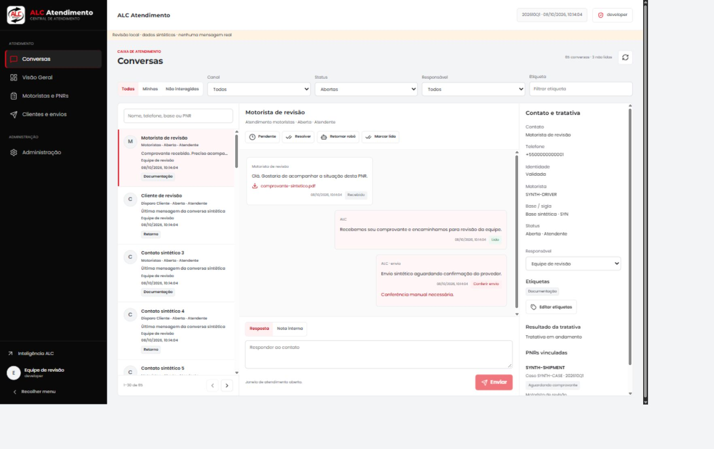
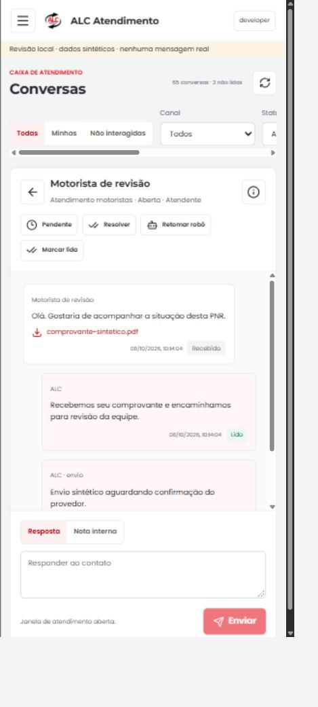

# Atendimento operacional

## Fronteiras preservadas

`apps/atendimento` continua sendo um processo Railway independente. `npm run build` / `npm start` pertencem ao Inteligencia; `npm run build:atendimento` / `npm run start:atendimento` pertencem ao Atendimento. A instalacao e o lockfile permanecem na raiz.

`packages/ui` possui consumidores reais nos dois aplicativos: Brand, componentes de indicadores/painel e tokens. O comportamento padrao continua sendo a marca do Inteligencia. O Atendimento usa os logos, icone, favicon SVG/ICO e Apple icon fornecidos em `ALC_Atendimento_Logos_Icones_Favicons.zip`; nao substitui os assets do painel. Os icones de comandos continuam sendo os mesmos componentes Lucide do pacote instalado, correspondente ao conjunto fornecido.

Core, RH, RLS e perfis nao foram alterados. O backend verifica a sessao, o comprovante de transferencia, MFA, perfil ativo e permissao independente do Atendimento em cada requisicao. `packages/identity/transfer` tambem valida o vinculo revogavel de entrada, sem tokens ou permissoes armazenados nele. A entrada direta encaminha ao fluxo central; nao existe login alternativo ou conta de demonstracao.

Tipografia igualada ao painel: Poppins global em 13px (pesos carregados 400/500/600), Montserrat nos titulos, titulo principal de 21px/700 e titulos de painel de 14px/650. As fontes sao carregadas por `next/font`, nao por CDN em tempo de execucao. A marca vetorizada fornecida permanece intacta.

O menu recolhido reutiliza o simbolo do Inteligencia em 38px. O cabeçalho concentra a area e o titulo da secao, sem titulo duplicado no corpo. Menu, navegacao e drawer usam transicoes de 140/180ms e respeitam movimento reduzido. O manifest publico permite instalacao com icones fornecidos de 192/512px; nao existe cache offline de dados privados ou service worker.

## Revogacao central

Um JWT Supabase assinado pode sobreviver ao logout ate expirar. Por isso, o painel registra um vinculo `sso_session_<session_id>` na tabela `alc_atendimento.settings` existente, com usuario, validade de 12h e estado ativo, sem credenciais. O comprovante assinado continua obrigatorio e vinculado ao mesmo usuario/sessao; o vinculo nao concede permissao nem substitui MFA ou consulta atual do perfil.

Logout e troca de conta revogam os vinculos do usuario e removem seus tickets pendentes em uma transacao. A sessao atual recebe um registro revogado mesmo se a abertura do Atendimento estiver em andamento; abrir outro ticket nao reativa esse registro. Falha de verificacao ou persistencia nao e anunciada como logout/troca bem-sucedidos. Sem integracao Aux configurada, o logout do painel independente permanece disponivel.

O Atendimento consulta o vinculo em cada requisicao autenticada. A interface revalida o perfil a cada 5s e em foco/visibilidade/pageshow, remove conteudo privado em erro e recarrega se mudar o usuario, sem reutilizar os dados da conta anterior. Abas suspensas dependem do retorno ao foco, enquanto as APIs continuam protegidas. Sessoes anteriores a esta versao nao possuem vinculo e devem reentrar pelo painel. Revogacoes externas feitas diretamente no provedor nao substituem este fluxo central.

Publique painel e Atendimento juntos: o painel anterior nao registra o vinculo exigido pelo Atendimento novo. Durante a troca de versoes o acesso pode ficar temporariamente indisponivel, sem liberar dados. Rollback deste contrato deve abranger os dois aplicativos; os registros de revogacao podem permanecer no Aux e nao exigem migracao ou exclusao de historico.

## Caixa e persistencia

- `/` abre Conversas. Visao Geral agrega dados reais, sem limite silencioso de linhas nas contagens.
- A lista consulta no servidor busca, canal, status, responsavel, etiqueta, Todas/Minhas/Nao interagidas; paginas de 30 conversas. A busca trata caracteres de LIKE como texto e usa parametros.
- Detalhes verificam escopo antes de acessar mensagens, fila ou PNRs. Historico de mensagens tem paginas de 50 com cursor data/UUID. PNRs vinculadas exigem ID, telefone e unidade exatos; detalhe limitado a 20 PNRs e consulta completa pelo fluxo do motorista preservada.
- Assumir, atribuir, colocar pendente, resolver, reabrir, retomar robo, validar motorista, etiquetas, leitura e notas sao persistidos no Aux. Notas nao criam jobs WhatsApp. Respostas exigem o responsavel atual, modo humano e janela de 24h.
- Mudancas de estado/responsavel/identidade cancelam respostas de texto pendentes do robo e da equipe, nao modelos iniciais. Lock por conversa serializa a mudanca com o envio em andamento. A auditoria faz parte da mesma transacao das acoes.
- O provedor tem timeout. Uma resposta ausente/ambigua, erro de rede ou 5xx fica `uncertain`; nao se reenvia automaticamente. Rejeicao explicita 4xx fica `failed`. Mensagens brutas do provedor nao sao devolvidas pela API.
- Mensagens recebidas suportam anexos da integracao existente e download autenticado. Upload/envio de novos anexos pelo atendente nao faz parte do contrato existente e nao foi adicionado.
- No celular a navegacao e lista -> conversa -> detalhes. Menu e modais controlam foco; Escape fecha. No desktop o menu pode ser recolhido.

## Fluxos e coleta

Foram reutilizados os roteiros deterministas de cliente/motorista, classificacoes, aprovacao de modelos Meta, idempotencia, webhooks e carga historica sem disparos. A negativa de recebimento representa o encaminhamento ao Mercado Livre como pendente; nao afirma alteracao externa.

A extensao 1.2.1 coleta a competencia vigente, mais recentes primeiro, e mantem o agendamento existente de 30 minutos. A Visao Geral permite **Coletar Cliente** (complementos de comprador disponíveis no Case Center, sem inventar telefone validado) e **Coletar Driver** (identificacao do motorista). As duas acoes consultam a mesma lista PNR do Case Center e atualizam o armazenamento existente de forma conservadora; nao criam filas de disparos. A coleta manual e a sincronizacao manual do Inteligencia suprimem o enfileiramento automatico mesmo se automacoes estiverem habilitadas. Importacoes de versoes anteriores sem o indicador explicito de automacao tambem permanecem somente dados. A coleta agendada continua condicionada as configuracoes preexistentes de automacao. O conector le os dados disponiveis do Case Center antes do complemento conservador em package-management. A administracao verifica a versao respondida pelo runtime do navegador (com ID da extensao), diferencia ponte sem resposta e versao antiga e exibe a versao exigida. Uma instalacao antiga deve ser substituida pelo ZIP 1.2.1 no chrome://extensions e a aba do ALC Atendimento deve ser recarregada; os botoes da Visao Geral impedem coleta com runtime antigo. A administracao tambem mostra a aba ML, ultima coleta e agendamento armazenado. Uma aba presente nao prova sessao autenticada: a coleta verifica isso. O cadastro de agendamento nao prova que o computador esteja ligado. Conversas atualizam em 5s/8s; resumo da fonte em 30s.

### Disparos por publico

`/disparos/clientes` e `/disparos/motoristas` reutilizam a mesma fila e o endpoint de envio existente. `/disparos` redireciona para clientes para preservar links antigos. Cada area separa previa e historico, com busca, base, status, competencia e paginas de 25 registros. Trocar de publico descarta a previa selecionada. A conferencia mostra o destinatario, telefone, pacote, caso e modelo antes de enfileirar um contato individual; somente os gestores ja autorizados podem confirmar.

A previa consulta ate 10.000 PNRs e o historico ate 1.000 jobs por canal, sempre com escopo aplicado antes do limite. O painel informa quando o limite e atingido; os contadores descrevem apenas o recorte consultado. O historico nao mistura publico de cliente e motorista. Telefone ausente, contato inicial ja registrado, competencia anterior e PNR encerrada continuam consultaveis, mas nao oferecem novo disparo inicial.

Nao foram criados modelos, regras de envio ou reenvios alternativos: `pnraberta` e `cliente_loss`, parametros confirmados, aprovacao Meta, janela de 24h e idempotencia por canal/caso/telefone permanecem validados no servidor. O endpoint tambem verifica o escopo da PNR escolhida. Envios incertos nao possuem botao de reenvio. Automacoes existentes nao sao ativadas por esta entrega.

### Entrada e ajustes

A transferencia `/atendimento` mostra a marca ALC e loading enquanto submete automaticamente o ticket de uso unico. O botao manual aparece somente se a submissao falhar ou JavaScript estiver desativado. Nao ha retry automatico, alteracao de prazo do ticket ou de validacao SSO. A pagina continua sem cache e sem referrer.

O grupo lateral agora e CONFIGURACOES e `/admin` e identificado como Ajustes, sem mudar permissoes ou URL. Automacoes e conector usam a largura da secao e se reorganizam em uma coluna no celular, sem paineis estreitos com espaco vazio ao lado.

## Migracao e rollback

O arquivo idempotente `apps/atendimento/db/001_atendimento.sql` adiciona etiquetas e indices e amplia a restricao de status para `pending`, exclusivamente em `alc_atendimento`. O pre-deploy existente aplica o arquivo no Aux. Nao apaga nem recria historico, mensagens, usuarios ou Core/RH. Nao houve execucao manual em banco remoto durante a implementacao.

Em rollback, mantenha a coluna/indices e a restricao ampliada: sao aditivos. Antes de usar uma versao antiga que desconheca `pending`, transfira esses atendimentos para `human` em operacao autorizada e auditada. Nao reduza a restricao com registros pendentes existentes.

## Referencia antiga e menus

O comunicador antigo foi inspecionado em 08/10/2026 na sessao aberta pelo usuario, somente em leitura. Foram observados os menus e as telas Disparo Cliente e Disparo de PNR: filtros, previa de destinatario, modelo e acompanhamento de envio. Esses recursos foram incorporados ao fluxo atual sem salvar configuracoes, ativar automacoes ou enviar mensagens no sistema antigo.

| Area essencial solicitada | Destino implementado |
| --- | --- |
| Caixas, atendentes, notas, status, detalhes | Conversas |
| Filas/pendencias e fonte | Visao Geral |
| Motoristas, PNRs e historico | Motoristas e PNRs |
| Contato inicial de clientes, resultados e falhas | Disparo Cliente + detalhe da conversa |
| Notificacoes de motoristas, resultados e falhas | Disparo Motorista + detalhe da conversa |
| Usuarios existentes/permissoes, canais, modelos, automacoes, auditoria | Configuracoes > Ajustes, nesta mesma aba |

Nao foi feita uma copia exaustiva de outros menus. Custos estimados, envio em lote e selecao arbitraria de modelos nao foram adicionados: dependem de precificacao confirmada e regras operacionais especificas. A entrega reutiliza os modelos e o envio individual ja existentes.

## Evidencia e dependencias externas

Capturas locais de componentes reais, exclusivamente com dados sinteticos:

Testes de fila, dominio, identidade e inbox usam mocks. A revisao visual usa componentes reais com dados sinteticos em fixture ignorada `.testagent/visual`, sem bypass dentro dos aplicativos, sem credenciais e sem envio real. Isso nao prova concorrencia PostgreSQL real nem um fluxo autenticado/MFA em producao.

Nesta revisao foram exercitados no navegador filtros, historico por publico, troca de area, conferencia do destinatario, enfileiramento exclusivamente sintetico, modal/Escape, loading e fallback. Geometria e controles foram verificados em 320px e desktop, sem overflow global; tabelas mantem scroll proprio. A captura de tela pelo navegador falhou por timeout: as imagens acima sao da revisao anterior, nao prova visual destes novos fluxos.

Validacao da entrega: 215 testes do Atendimento e 346 do Inteligencia passaram, assim como typecheck e ambos os builds. Lint do Atendimento e dos arquivos alterados do Inteligencia passou. O lint global do Inteligencia permanece bloqueado por quatro erros preexistentes de setState em effects, fora deste diff.

O acesso inicial da CLI Railway pertence a outra conta, sem o projeto ALC listado. A publicacao deve seguir a integracao GitHub existente, sem duplicar deployments ou mudar servicos/credenciais. A rota publica `/health` inclui `RAILWAY_GIT_COMMIT_SHA` quando disponivel para confirmar a versao; status HTTP e SHA publicados devem ser verificados antes de declarar publicacao confirmada.

Homologacao externa pendente: abertura pelo Inteligencia com uma conta autorizada e MFA; revogacao em uma aba aberta; sessao/coleta ML real; autorizacao de package-management; entrega/leitura dos webhooks Meta e modelos aprovados. A validacao automatizada nao envia mensagens para contatos reais.
